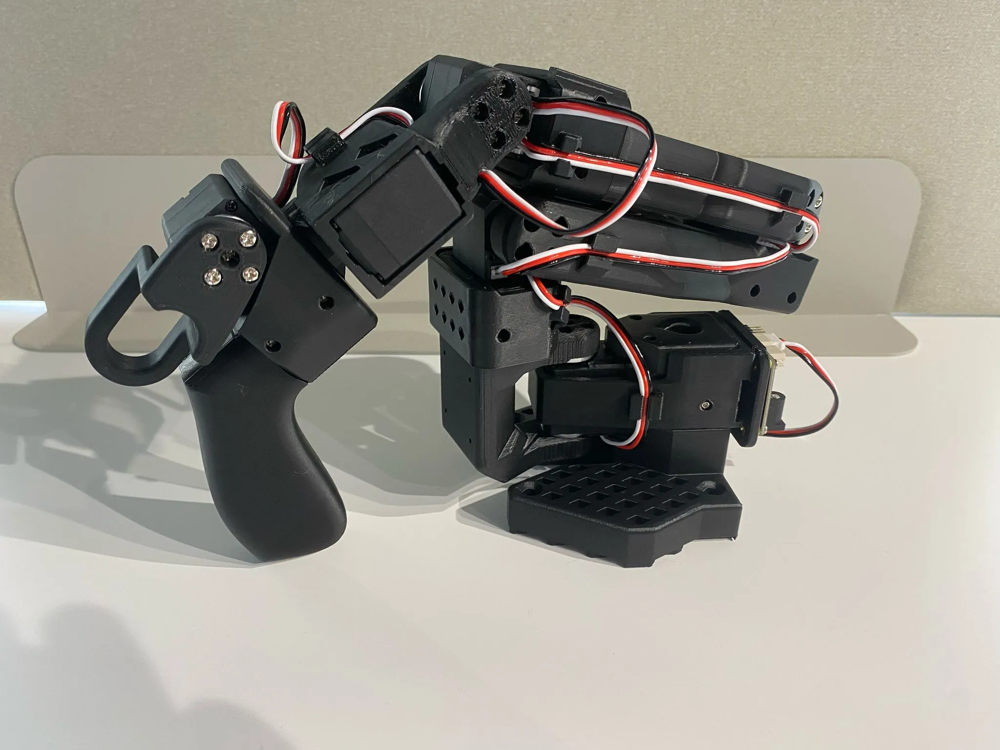

# LeRobot SO101 기반 초·중급 로봇 AI 교육 커리큘럼 기획안

## 현재 운영 범위
- 초급 트랙: [basic_curriculum.md](./basic_curriculum.md)
- 중급 트랙: [intermediate_curriculum.md](./intermediate_curriculum.md)
- 후속 확장 메모: [advanced_curriculum.md](./advanced_curriculum.md)

---

## 문서 목적

본 문서는 **LeRobot**을 기본 학습 스택으로, **LeRobot SO101**을 공통 교재 겸 실습 플랫폼으로 삼는 교육 커리큘럼 기획안이다. 현재 목표는 연구 중심의 고급 VLA 과정까지 한 번에 운영하는 것이 아니라, **SO101 한 가지 플랫폼으로 초급과 중급 과정을 안정적으로 운영**할 수 있는 구조를 만드는 데 있다.

따라서 본 문서의 중심은 다음 두 가지다.

1. 초급자는 **SO101을 안전하게 다루고, LeRobot으로 데이터를 수집하고, 기본 모델을 실행**할 수 있어야 한다.
2. 중급자는 동일한 SO101을 기반으로 **데이터 품질 관리, 모델 학습, 평가, 시뮬레이터 연계까지 확장**할 수 있어야 한다.

---

## 고정 기준

### 공통 교재 및 실습 플랫폼
- **기준 하드웨어**: LeRobot SO101
- **기준 소프트웨어**: LeRobot, LeRobotDataset, `lerobot-record`
- **공통 과제 유형**: 단일 물체 집기, 위치 이동, 간단한 pick-and-place
- **공통 산출물**: 데이터셋, 학습 로그, 평가 기록, 데모 영상, 실습 보고서

### 설계 원칙
1. **LeRobot first**: 설치, 데이터 수집, 학습, 평가 흐름을 LeRobot 기준으로 설명한다.
2. **SO101 one-platform**: 초급과 중급 모두 동일한 SO101 하드웨어를 기준으로 운영한다.
3. **Real robot first**: 초급은 실로봇 운용을 먼저 익히고, Isaac Sim은 중급 이후 확장 도구로 사용한다.
4. **Same task, deeper depth**: 초급과 중급은 유사한 태스크를 다루되, 난도와 평가 수준만 높인다.
5. **Reproducibility over novelty**: 최신 논문 리뷰보다 재현 가능한 실습과 안전한 운영을 우선한다.

### 범위에서 제외하는 것
- OpenVLA, 대규모 분산 학습, 다중 GPU 최적화
- 통계 검정 중심의 연구형 Sim2Real 실험
- 고가 휴머노이드/범용 산업용 로봇 기반 실습

위 항목은 현재 운영 범위가 아니라 **후속 확장 주제**로만 둔다.

---

## 왜 SO101 중심인가

- **교재와 장비를 일치**시킬 수 있어 수업 준비가 단순하다.
- **LeRobot 예제 흐름과 직접 연결**되므로 학습자가 전체 파이프라인을 이해하기 쉽다.
- **초급부터 실물 로봇 경험**을 줄 수 있어 동기 부여가 강하다.
- 중급에서 동일 장비를 기반으로 **데이터 품질, 모델 성능, 시뮬레이터 확장**까지 자연스럽게 이어갈 수 있다.

---

## 설명용 이미지 자료

아래 이미지는 수업 소개 자료, 오리엔테이션 문서, 과정 안내 슬라이드에 바로 활용할 수 있도록 로컬에 저장한 참고 이미지다.

### SO101 Follower 예시

출처: https://huggingface.co/datasets/huggingface/documentation-images/resolve/main/lerobot/SO101_Follower.webp

### SO101 Leader 예시

출처: https://huggingface.co/datasets/huggingface/documentation-images/resolve/main/lerobot/SO101_Leader.webp

### LeRobot VLA 아키텍처 참고 이미지

출처: https://raw.githubusercontent.com/huggingface/lerobot/main/media/readme/VLA_architecture.jpg

---

## 트랙 비교

| 구분 | 초급 트랙 | 중급 트랙 |
|---|---|---|
| 대상 | LeRobot과 로봇 실습이 처음인 학습자 | 초급 이수자 또는 동등 수준 학습자 |
| 기간 | 6주 | 8주 |
| 핵심 목표 | SO101 운용, 데이터 수집, 기본 모델 실행 | SO101 기반 데이터셋 고도화, 학습, 평가, 시뮬 연계 |
| 필수 도구 | SO101, LeRobot, 카메라, Python 개발 환경 | 초급 도구 + GPU 환경 + Isaac Sim(중급 후반) |
| 필수 결과물 | 소규모 데이터셋, 데모 영상, 실습 로그 | 데이터셋 카드, 학습 로그, 평가표, 최종 프로젝트 |
| 시뮬레이터 비중 | 선택 또는 시연 수준 | 확장 모듈로 활용 |

---

## 공통 실습 환경

### 필수 준비물
- Ubuntu 22.04 권장
- Python 개발 환경(venv 또는 conda)
- LeRobot SO101 실습 키트
- USB 카메라 또는 웹캠 1대
- 안전한 작업대, 전원, 정리된 케이블 환경

### 권장 준비물
- 학습 로그 확인용 TensorBoard 또는 W&B
- 중급 실습용 NVIDIA GPU 환경
- 중급 후반용 Isaac Sim 실습 PC 또는 공용 서버

### 운영 메모
- 초급은 **실로봇 운용과 데이터 수집 경험**이 우선이다.
- 중급부터 **모델 성능 개선과 재현성**을 강조한다.
- Isaac Sim, ROS 2, 도메인 랜덤화는 **중급 확장 주제**로 다룬다.

---

## 공통 태스크 제안

교재와 데이터셋, 평가 기준을 단순하게 유지하기 위해 초급과 중급 모두 동일한 태스크군에서 시작하는 것이 좋다.

- **기본 태스크 A**: 큐브 1개 집기
- **기본 태스크 B**: 지정 위치로 큐브 옮기기
- **기본 태스크 C**: 색상 또는 위치 조건이 있는 pick-and-place

초급은 A와 B 중심, 중급은 B와 C 중심으로 운영한다.

---

## 초급 트랙 운영 요약

초급 과정의 목적은 “로봇을 이해하는 것”보다 먼저 **SO101을 안전하게 켜고, 조작하고, 데이터를 만들고, LeRobot으로 기본 모델을 실행하는 것**이다.

| 주차 | 모듈 | 핵심 내용 | 필수 산출물 |
|---|---|---|---|
| 1주차 | SO101 오리엔테이션 | 장비 구성, 안전 수칙, 작업 공간 세팅 | 안전 체크리스트, 장비 점검표 |
| 2주차 | LeRobot 설치 및 Bring-up | 개발 환경 구성, SO101 연결, 기본 동작 확인 | 설치 로그, bring-up 기록 |
| 3주차 | Teleoperation 입문 | 수동 조작, 카메라 확인, 기본 태스크 수행 | 시연 영상, 조작 기록 |
| 4주차 | 데이터 수집 | `lerobot-record` 기반 에피소드 기록 | 초급 데이터셋 초안 |
| 5주차 | 기본 모델 실행 | 데이터 재생, 기본 학습 또는 사전학습 모델 실행 | 체크포인트 또는 실행 로그 |
| 6주차 | 미니 캡스톤 | pick-and-place 데모와 결과 정리 | 데모 영상, 짧은 보고서 |

초급에서는 **과한 모델 이론보다 데이터와 조작 경험**이 더 중요하다.

---

## 중급 트랙 운영 요약

중급 과정의 목적은 초급에서 만든 감각을 바탕으로 **재현 가능한 SO101 기반 학습 파이프라인**을 스스로 설계하고 운영하게 만드는 것이다.

| 주차 | 모듈 | 핵심 내용 | 필수 산출물 |
|---|---|---|---|
| 1주차 | 태스크 재정의와 평가 기준 | 태스크 스펙, 성공 조건, 실패 로그 기준 | 태스크 정의서 |
| 2주차 | SO101 정밀 세팅 | calibration, homing, camera view, gripper 세팅 | 세팅 기록표 |
| 3주차 | 데이터 품질 관리 | 수집 프로토콜, episode naming, metadata 점검 | 데이터 수집 SOP |
| 4주차 | LeRobot 학습 파이프라인 | 데이터 로딩, 학습 설정, 로그 추적 | 학습 설정 파일, 로그 |
| 5주차 | 실기 평가 | closed-loop 평가, 성공률 기록, failure case 정리 | 평가표, 실패 분석 |
| 6주차 | Isaac Sim 미러 태스크 | SO101 태스크를 시뮬레이터에 대응시키기 | 미러 환경 초안 |
| 7주차 | 강인성 향상 | 데이터 추가 수집, 랜덤화, 선택적 ROS 2 연계 | 개선 실험 기록 |
| 8주차 | 최종 프로젝트 | 데이터-학습-평가-데모 일체형 프로젝트 | 최종 보고서, 데모 영상 |

중급의 Isaac Sim은 **필수 전제 조건**이 아니라, SO101 실습을 확장하는 도구로 다룬다.

---

## 평가 체계

### 초급 평가
- 안전 수칙 준수 여부
- SO101 bring-up 성공 여부
- 기본 태스크 데이터 수집 완료 여부
- 간단한 자율 동작 또는 재생 데모 성공 여부

### 중급 평가
- 데이터셋 구조와 메타데이터 정합성
- 학습 로그와 실험 기록의 재현성
- 실제 태스크 성공률과 실패 분석 품질
- 최종 프로젝트 문서화 수준

---

## 권장 산출물 템플릿

- **장비 점검표**: 전원, 연결, 초기 자세, 카메라 시야, 안전 확인
- **데이터셋 카드**: 태스크 설명, 수집 조건, episode 수, 실패 사례
- **모델 기록표**: 사용 데이터셋, 학습 시간, 하이퍼파라미터, 체크포인트 경로
- **평가표**: 성공률, 반복 횟수, 실패 유형, 개선 메모

---

## 운영상 핵심 제안

1. 초급과 중급 모두 **SO101 하나의 하드웨어로 통일**한다.
2. 초급에서는 Isaac Sim을 메인으로 두지 말고, **실로봇 실습을 메인**으로 둔다.
3. 중급에서만 Isaac Sim, ROS 2, 도메인 랜덤화를 **선택 확장 모듈**로 도입한다.
4. OpenVLA나 연구형 Sim2Real 통계 검정은 지금 단계의 메인 과정이 아니라 **후속 확장 과제**로 남긴다.

---

## 후속 확장

현재 운영 범위는 초급과 중급이다. 고급 연구 트랙이 필요할 경우에는 [advanced_curriculum.md](./advanced_curriculum.md)를 **후속 확장 메모**로 참고해 별도 설계하는 방식이 적절하다.
