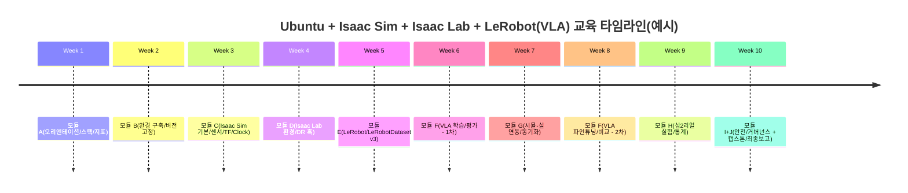
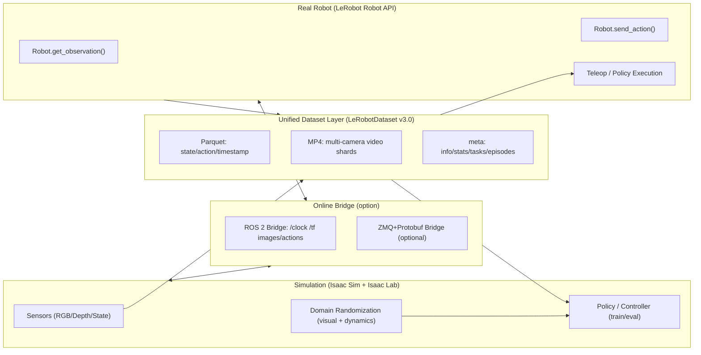

# Ubuntu–Isaac Sim–Isaac Lab–VLA 학습도구 기반 LeRobot 연동 교육 커리큘럼 기획 및 보고서

📁 **[수준별 커리큘럼 파일 목록]**
- 🟢 **초급자용 (6주 입문 과정)** : [basic_curriculum.md](./basic_curriculum.md)
- 🟡 **중급자용 (전공 대학생 대상 8주 과정)** : [intermediate_curriculum.md](./intermediate_curriculum.md)
- 🔴 **고급자용 (연구원/시니어 대상 10주 심화 과정)** : [advanced_curriculum.md](./advanced_curriculum.md)

---

## Executive Summary

본 보고서는 **Ubuntu + NVIDIA Isaac Sim + Isaac Lab + VLA(vision-language-action) 학습도구**를 기반으로, **Hugging Face LeRobot**(데이터셋/로봇 제어/학습·평가 스택)과 연동되는 **실습 중심 교육 커리큘럼**을 설계한다. 핵심 설계 원칙은 “**하나의 표준 데이터/스키마로 시뮬레이션과 실로봇을 관통**”하는 것이다. 이를 위해 (1) 시뮬레이터에서 생성되는 센서·상태·행동·언어 지시를 **LeRobotDataset v3.0(Parquet+MP4, 메타데이터 기반 에피소드 재구성)**으로 기록·정규화하고, (2) 동일 포맷으로 실로봇에서 수집한 시연/실행 로그를 저장하여, (3) LeRobot의 VLA/IL/RL 정책 학습 및 벤치마크 평가 체인(예: LIBERO)을 통해 **심2리얼 전이 성능을 정량 검증**하는 루프를 구성한다.

운영 관점에서 가장 큰 리스크는 **버전/런타임 불일치(드라이버·ROS 2)**와 **실로봇 안전/데이터 거버넌스**다. Isaac Sim 5.1 기준으로 Ubuntu 22.04/24.04 및 특정 드라이버(예: Linux 580.65.06)가 요구된다.

---

## 기술 스택 전제조건 및 용어 정의

**대상(학습자/교육 수준): 초급·중급·고급 각 수준에 맞는 커리큘럼이 별도 파일로 제공된다.**

### 필수 SW/HW 전제조건

**운영체제(호스트)**  
- **Ubuntu 버전 범위: 22.04 / 24.04 (x86_64)**를 기본 범위로 설정한다(Isaac Sim 5.1 시스템 요구사항 표기).   
- Omniverse/Kit 계열도 Ubuntu 22.04/24.04를 지원 OS로 명시한다.   
- Isaac Lab 문서의 “기본 요구사항”은 Ubuntu 22.04를 명시하므로, 커리큘럼 운영 기준 OS는 **Ubuntu 22.04 LTS(권장)**, 확장 옵션으로 **Ubuntu 24.04 LTS(허용/검증 필요)**로 두는 것이 현실적이다.

**GPU/드라이버(가장 중요: Omniverse RTX·렌더러 검증)**  
- Isaac Sim 5.1 요구사항: Linux 드라이버 **580.65.06**(테스트/권장), GPU VRAM 최소 16GB(권장).   
- Isaac Lab 설치 가이드도 Linux에서 **580.65.06 이상(Production Branch)** 권장을 명시한다.   
- Omniverse Technical Requirements는 R570/R580 Production Branch 드라이버 라인업과 “구버전 미지원/신버전 미검증 가능”을 명확히 한다. 따라서 커리큘럼은 “지원 드라이버 범위 내에서 재현 가능한 실습”을 운영 규칙으로 고정해야 한다. 

**CUDA (학습/추론 관점의 실질 요구)**  
- Isaac Sim 자체는 “CUDA Toolkit을 별도 설치해야만 실행된다”는 형태가 아니라, 주로 **GPU 드라이버/RTX 기능/Omniverse 검증**이 우선이다(요구사항/Technical Requirements가 드라이버 중심으로 기술).   
- 다만 VLA/정책 학습은 PyTorch CUDA 빌드에 의해 좌우되므로, 커리큘럼 운영 문서에는 **“학습용 PyTorch CUDA 빌드(예: cu12/cu13)는 선택 HW·드라이버에 맞춰 고정”**이라는 원칙을 포함해야 한다(세부 버전은 교육 기관 환경에 따라 **미지정**).  
- aarch64(DGX Spark)처럼 특정 환경은 CUDA ≥13 제약이 나타날 수 있으나, 본 보고서의 기본 트랙은 x86_64 Ubuntu(22.04/24.04) 기준이다. 

**Omniverse/Isaac Sim 설치 방식(런처 폐지 이후)**  
- Omniverse Launcher는 2025-10-01부터 단계적으로 사용 불가/폐지(문서 경고)로 명시되어 있다. 따라서 교육 운영은 **(A) 바이너리(압축 해제) 설치, (B) pip 기반 구성, (C) 컨테이너(NGC)** 중 하나(또는 혼합)로 표준화해야 한다.   
- Isaac Sim은 “Python namespace packages(pip)”를 제공한다(isaacsim metapackage 등).   
- 컨테이너 배포는 공식 문서에서 `docker pull nvcr.io/nvidia/isaac-sim:5.1.0` 등으로 안내된다. 

**Isaac Lab(시뮬 기반 로봇 학습 프레임워크)**  
- Isaac Lab은 Isaac Sim 위에서 동작하며 RL/IL/모션플래닝 등 로봇학습 워크플로우를 통합하는 오픈소스 프레임워크로 소개된다.   
- Isaac Lab–Isaac Sim 버전 의존성이 문서화되어 있으며(main/v2.3.x가 4.5/5.0/5.1과 호환 등), 교육 과정은 특정 조합으로 “고정된 재현 환경”을 제공해야 한다. 

**ROS 2(시뮬-로봇 미들웨어 표준) 연동 전제**
- Isaac Sim ROS 2 브리지 문서는 ROS 2 Humble/Jazzy와의 조합 및 ROS 2 워크스페이스 빌드 절차를 제시한다. Isaac Sim이 요구하는 Python 버전과 ROS 2 배포판의 기본 Python 버전이 다를 수 있으므로, 연동 시 호환성을 확인해야 한다.
- 시간 동기화를 위해 `/clock` 토픽과 `use_sim_time`의 사용이 ROS 2 튜토리얼로 제공된다.
- TF 트리(`/tf`) 퍼블리시 및 오도메트리 구성도 Isaac Sim ROS 2 튜토리얼로 제공되어, 시뮬-실 로봇 공통의 좌표계/프레임 관리 실습이 가능하다.

### “VLA 학습도구” 정의(본 커리큘럼에서의 의미)

요청의 “VLA 학습도구”는 제품명이 **미지정**이므로, 본 보고서에서는 다음과 같이 **운영 가능한 도구 정의**로 고정한다.

- **VLA(vision-language-action)**: 시각/언어 입력을 받아 로봇 행동을 출력하도록 학습되는 모델군. RT-2는 로봇 행동을 텍스트 토큰 형태로 통합해 비전-언어 모델과 로봇 궤적 데이터를 공동 미세조정(co-fine-tuning)하는 접근을 “VLA”로 정의/소개한다.   
- **LeRobot을 “기본 VLA 학습도구”로 채택**: LeRobot는 PyTorch 기반으로 IL/RL뿐 아니라 **VLA 모델 카테고리**를 구현/학습(예: SmolVLA 등)할 수 있다고 명시한다. 또한 로봇 제어 인터페이스와 데이터셋 표준(LeRobotDataset)을 함께 제공하므로 교육에서 “수집→학습→배포”를 한 스택으로 연결할 수 있다.   
- **OpenVLA를 “확장(선택) VLA 학습도구”로 병행**: OpenVLA는 “VLA 학습·파인튜닝을 위한 오픈소스 코드베이스”를 제공하며, LoRA 등 파라미터 효율적 미세조정과 평가 절차(시뮬 벤치마크 포함)를 문서화한다. 교육 과정의 고급 트랙에서 비교 실험 대상으로 유용하다. 

---

## 커리큘럼 설계 원칙과 모듈 상세

### 설계 원칙(교육 대상 미지정 조건 반영)

1) **재현 가능한 “버전 고정형 실습”**: GPU 드라이버/Isaac Sim/Isaac Lab/ROS 2의 버전 불일치가 가장 큰 실패 요인이므로, 모듈별로 “검증된 조합”을 명시한다. 특히 Isaac Sim 5.1의 OS(22.04/24.04), 드라이버(580.65.06)를 기준선으로 둔다.   

2) **데이터 중심(LeRobotDataset)으로 시뮬–실을 통합**: 시뮬/실 데이터 모두를 LeRobotDataset v3.0(Parquet+MP4, 메타 기반 에피소드)로 수렴시켜 모델 학습/평가 파이프라인을 단순화한다.   

3) **연동은 두 레이어로 분리**  
- (오프라인) 데이터 교환: LeRobotDataset v3.0  
- (온라인) 제어/관측 스트리밍: ROS 2(표준) 또는 ZMQ+Protobuf(대안)  

ROS 2 연동은 Isaac Sim 내장 브리지(OmniGraph 노드 제공)를 사용하고, ZMQ 브리지는 “ROS가 아닌 환경”을 위한 레퍼런스 구현으로 보조 경로로 둔다.   

4) **심2리얼은 “가설-변수-통계 검증”을 교육 산출물로 강제**: 단순 데모가 아니라, 도메인 랜덤화(시각·물리) 강도와 실데이터 보정량(예: few-shot 파인튜닝)에 따른 성능 변화를 통계적으로 검증한다.   

### 모듈 구성(권장 예시: 10모듈)

- 총 교육 기간: **미지정**  
- 아래 시간은 “권장 예시(총 60–90시간)”이며, 운영 상황에 따라 단축/확장 가능(세부 시간의 합은 커스터마이징 가능).

**모듈 A: 오리엔테이션·전체 아키텍처·성공 기준 정렬**  
- 이론: (a) VLA 개념(시각·언어·행동), (b) 심2리얼 “리얼리티 갭” 문제, (c) 데이터셋 표준화의 필요성. RT-2가 제시한 VLA 정의(행동을 토큰화/공동학습)로 “언어 지시→행동”을 정식화한다.   
- 실습 시나리오(1–2h): “과제정의서” 작성(관측·행동·환경·성공 조건), LeRobotDataset 스키마 초안 정의(meta/info.json에 들어갈 feature 목록 수준).   
- 실습 시간: 4–6h  
- 필요 리소스: 템플릿 문서, 샘플 데이터셋(기존 공개 LeRobotDataset)  
- 산출물: 프로젝트 스펙 1p, 데이터 스키마 초안, 평가 지표 정의서

**모듈 B: 워크스테이션/서버 환경 구축(버전 고정)**  
- 이론: Omniverse/Isaac Sim이 드라이버·RTX 렌더러·OS에 민감한 이유(검증/지원 범위).   
- 실습 시나리오:  
  - Ubuntu 22.04/24.04 중 선택(운영 기준은 22.04 권장), GPU 드라이버를 Production Branch 권장 버전으로 맞추고 Isaac Sim Compatibility Checker로 검증(가능 시).   
  - 설치 방식 3종 비교 실습: (1) 바이너리 압축 해제 설치(Quick Install), (2) pip 설치(isaacsim 패키지), (3) 컨테이너(Headless/Streaming) 개념 확인.   
  - 컨테이너를 쓰는 경우 NVIDIA Container Toolkit 설치 절차 확인.   
- 실습 시간: 8–12h  
- 필요 리소스: RTX GPU(권장 16GB VRAM+), SSD(수십~수백 GB), 네트워크(자산 다운로드)   
- 산출물: 환경 재현 문서(버전표/설치 로그/검증 스크린샷), “버전 고정” 체크리스트 완료

**모듈 C: Isaac Sim 기초(USD/센서/물리/자산)**  
- 이론: Isaac Sim의 로봇/센서 시뮬 및 외부 통신 확장 구조(Extensions/OmniGraph).   
- 실습 시나리오:  
  - 카메라/Depth/포인트클라우드 등 센서 구성 후 ROS 2 퍼블리시, 토픽 리스트 및 RViz2 확인(가능 시).   
  - TF 트리 퍼블리시(카메라/로봇 링크 프레임), `/tf` 확인.   
- 실습 시간: 8–10h  
- 필요 리소스: Isaac Sim 샘플 씬, ROS 2 터미널(선택)  
- 산출물: (a) 센서 퍼블리시 그래프, (b) TF 트리 캡처, (c) 샘플 씬 수정본

**모듈 D: Isaac Lab로 로봇학습 환경 구성(RL/IL, 랜덤화 훅)**  
- 이론: Isaac Lab의 목적(로봇학습 워크플로우 통합), Isaac Sim 위에서의 GPU 가속/센서 시뮬 활용.   
- 실습 시나리오:  
  - Isaac Lab–Isaac Sim 호환 조합 선택(예: Isaac Sim 5.1 + Isaac Lab main/v2.3.x 계열).   
  - 환경 생성(Direct/Manager-based 중 택1) 후 “도메인 랜덤화 이벤트”를 구성 요소로 삽입한다. Isaac Lab에서는 랜덤화가 `EventTermCfg` 기반 구성으로 설명된다.   
- 실습 시간: 10–14h  
- 필요 리소스: Isaac Lab 튜토리얼 베이스 코드, GPU 메모리 여유(훈련/동시 환경 수)   
- 산출물: 학습 환경 코드(랜덤화 옵션 포함), 학습 로그/체크포인트(초기)

**모듈 E: LeRobot 기초(로봇 인터페이스·데이터셋·기본 정책 학습)**  
- 이론: LeRobot의 목적(로봇 제어 인터페이스 + 데이터셋 표준 + SOTA 정책 학습/평가).   
- 실습 시나리오:  
  - 지원 하드웨어 범위 파악(예: SO100/Reachy2/Unitree G1 등) 및 “Robot 인터페이스”로 관측/행동 루프 작성 개념 확인.   
  - LeRobotDataset v3.0 구조 학습: Parquet(상태/행동/타임스탬프) + MP4(멀티카메라), meta/info.json·stats.json·tasks.jsonl의 역할 확인.   
  - `lerobot-record`로 “언어 지시(예: Grab the black cube)”를 포함한 데이터 기록 흐름 이해(teleop leader/follower 포함).   
- 실습 시간: 8–12h  
- 필요 리소스: (선택) 실로봇/카메라, 또는 공개 데이터셋(허브)  
- 산출물: (a) 로컬 LeRobotDataset v3.0 샘플, (b) 데이터 시각화/검증 리포트

**모듈 F: VLA 학습(LeRobot VLA + 선택 OpenVLA 비교)**  
- 이론: VLA에서 “언어-시각-행동 정렬”의 핵심, 데이터 믹스/지시문(task) 설계의 역할. LeRobotDataset v3는 tasks.jsonl로 자연어 태스크를 정규화해 task-conditioned 정책을 지원한다.   
- 실습 시나리오:  
  - LeRobot의 VLA 모델 카테고리(예: SmolVLA 등) 중 1개를 선택해 학습/파인튜닝, `lerobot-eval`로 시뮬 벤치마크(LIBERO 등) 평가.   
  - (확장) OpenVLA를 동일(또는 근접) 태스크/데이터로 파인튜닝(LoRA 포함) 후 성능/지연 비교.   
- 실습 시간: 10–16h(학습 자원에 따라 변동)  
- 필요 리소스: GPU(학습), 데이터셋(시뮬+실)  
- 산출물: (a) 학습된 체크포인트, (b) 평가 로그/성공률 리포트, (c) 에러 분석(실패 유형 taxonomy)

**모듈 G: 시뮬레이터–실로봇 연동(온라인 제어 + 오프라인 데이터)**  
- 이론: “오프라인 데이터 표준화”와 “온라인 제어 동기화” 분리. ROS 2 브리지(토픽 pub/sub, `/clock`, `/tf`) 또는 ZMQ+Protobuf 브리지 대안 비교.   
- 실습 시나리오:  
  - Isaac Sim에서 ROS 2 브리지 활성화 후 `/clock` 기반 시뮬 타임 동기화, TF 트리/카메라 토픽 송수신 확인.   
  - (대안 트랙) IsaacSimZMQ 레퍼런스를 통해 카메라 RGB/Depth 스트리밍과 제어 커맨드 교환을 경험(ROS 비사용 환경).   
- 실습 시간: 8–14h  
- 필요 리소스: ROS 2 환경, 네트워크(동일 호스트 또는 LAN)  
- 산출물: (a) 브리지 구동 체크리스트, (b) lat/throughput 측정 로그, (c) 데이터↔제어 매핑 문서

**모듈 H: 심2리얼 전이 실험 실행(도메인 랜덤화·보정·통계)**  
- 이론: 도메인 랜덤화(시각/물리)와 동역학 랜덤화의 근거(리얼리티 갭 완화), 실험 설계 원칙.   
- 실습 시나리오: “실험 설계 표”에 따라 조건별 학습/테스트, 실로봇에서 n회 반복 실행, 성공률/시간/안전 이벤트 기록 후 통계 검정.  
- 실습 시간: 12–20h  
- 필요 리소스: 실로봇, 안전 장치, 로그 수집 시스템  
- 산출물: 심2리얼 실험 리포트(가설 검정 포함), 재현 가능한 코드/설정 스냅샷

**모듈 I: 안전·윤리·운영(하드웨어·데이터 거버넌스)**  
- 이론: 로봇 정지 기능(정상/보호/비상정지)과 리스크 평가, 협동로봇 안전 모드 개요.   
- 실습 시나리오: E-stop 절차 리허설, 데이터 접근권한/보관정책 문서화, 사고/근접사고(near-miss) 보고 루프 구축. NIST는 로봇 운용 전 **비상정지 절차 숙지**를 강조한다.   
- 실습 시간: 4–6h  
- 산출물: 안전 체크리스트, 데이터 관리 SOP

**모듈 J: 캡스톤(엔드투엔드 데모 + 보고서)**  
- 목표: “언어 지시 기반 조작 과제”를 시뮬에서 학습하고 실로봇에서 성공률 기준을 달성하도록 통합.  
- 산출물: (a) 데모 영상, (b) 데이터셋/모델 카드(문서), (c) 심2리얼 결과 보고서

### 모듈별 체크리스트 표(필수 산출물)

| 모듈 | 체크리스트(완료 기준) | 산출물(파일/로그) |
|---|---|---|
| A | 목표 과제의 관측·행동·성공조건 정의 완료 / 데이터 스키마 초안 작성 | 스펙 1p, 스키마 문서 |
| B | Ubuntu 버전·GPU 드라이버·Isaac Sim·Isaac Lab 버전표 고정 / 실행 검증 | 환경 재현 문서, 실행 로그 |
| C | ROS 2 카메라/TF 퍼블리시 확인(또는 대안 스트리밍) | 토픽 캡처, TF 트리 증빙 |
| D | Isaac Lab 환경 생성 + DR 이벤트 훅 삽입 | env 코드, 학습 로그 |
| E | LeRobotDataset v3.0 로 기록/로딩/검증 성공 | data/ videos/ meta/ 구조 |
| F | VLA 학습 1회 이상 + 벤치마크 평가 1회 이상 | 체크포인트, eval 리포트 |
| G | (ROS 2 또는 ZMQ) 온라인 통신 루프 지연·드롭률 측정 | 측정 로그, 매핑 문서 |
| H | 실험 설계표 조건 최소 2조건 이상 실행 + 통계 검정 | 실험 리포트(재현 가능) |
| I | E-stop/리스크 절차 문서화 + 데이터 접근 정책 확정 | 안전 SOP, 거버넌스 문서 |
| J | 엔드투엔드 데모 + 학습/평가/전이 결과 종합 | 최종 보고서, 데모 영상 |

---

## 시뮬레이터–실로봇 연동 워크플로우

본 섹션은 **데이터 교환 포맷**, **통신 프로토콜**, **동기화 방법**을 “오프라인/온라인”으로 분리해 정의한다.

### 오프라인 데이터 교환 포맷(표준: LeRobotDataset v3.0)

**권장 포맷: LeRobotDataset v3.0**  
- 저차원 고주파 신호(상태/행동/타임스탬프): **Apache Parquet**  
- 시각 데이터: 카메라별 **MP4 샤드**  
- 에피소드 경계/검색/정규화 통계/태스크: meta 디렉터리(예: info.json, stats.json, tasks.jsonl, episodes 메타)   

**언어 지시(task) 표현**  
- `meta/tasks.jsonl`에 자연어 태스크 설명을 정수 ID에 매핑하는 구조가 명시되어 있어, “언어 조건부 정책” 설계가 용이하다.   

**시뮬→데이터 수집(권장 구현)**  
- Isaac Sim/Isaac Lab에서 관측(obs: RGB/Depth/상태), 행동(action: 조인트/EE), 타임스탬프를 프레임 단위로 수집  
- LeRobotDataset writer로 프레임을 추가하고, 에피소드 저장 후 `finalize()`로 Parquet writer를 닫아 데이터 무결성을 보장(문서에서 필수로 강조).   

### 온라인 통신 프로토콜(표준: ROS 2, 대안: ZMQ+Protobuf)

**표준 프로토콜: ROS 2 (DDS 기반 메시징)**  
- Isaac Sim은 ROS/ROS2 브리지 확장을 통해 pub/sub(토픽·서비스)을 제공하며, ROS2 브리지는 확장에서 활성화한다(ROS/ROS2 동시 활성화 불가).   
- 카메라 데이터 퍼블리시, TF 트리 퍼블리시, `/clock` 퍼블리시 등은 튜토리얼/노드로 제공된다.   
- 단, Isaac Sim 내부 Python 버전과 외부 ROS 2 노드의 Python 버전이 다를 수 있으므로, 실로봇/외부 노드는 “DDS 레벨에서만 연동”하는 형태(Isaac Sim 내부와 외부 노드가 각자의 Python 환경 사용)도 가능하다는 가이드가 있다.

**대안 프로토콜: IsaacSimZMQ (ZeroMQ + Protobuf)**  
- ROS를 사용하지 않는 워크플로우를 위해, Isaac Sim ↔ 외부 애플리케이션 간 양방향 통신 레퍼런스가 제공된다(카메라 RGB/Depth 스트리밍, bbox/제어 커맨드 교환 등).   
- 교육에서는 “ROS 2 기반(정석)”과 “ZMQ 기반(경량/ML 파이프라인 친화)”을 비교하는 실습으로 구성할 수 있다.

### 동기화 방법(시간·프레임·좌표계)

**시간 동기화(ROS 2)**  
- 시뮬레이션 타임을 외부 노드와 맞추기 위해 `/clock` 토픽을 사용하며, 외부 노드는 `use_sim_time=True`로 시뮬 시간 구독을 활성화한다.   

**좌표계 동기화(ROS 2 TF /tf)**  
- Isaac Sim은 TF 퍼블리시(카메라, 로봇 관절 체인 등)를 지원하며, `/tf` 토픽으로 트리 확인이 가능하다. 실로봇 측 좌표계(베이스/EE/카메라)와 시뮬 좌표계를 맞추기 위한 “프레임 계약(frame contract)”을 커리큘럼 산출물로 강제하는 것이 좋다.   

**센서/제어 주기 동기화**  
- 카메라 퍼블리시 주기 및 publish rate 설정은 특정 노드/튜토리얼로 다뤄진다(교육에서는 “관측 주기≠제어 주기” 상황에서 지연/드롭이 정책 성능에 미치는 영향까지 확장 가능).   

### 시뮬레이터 vs 실제 비교표(필수 산출물)

| 항목 | 시뮬레이터(Isaac Sim/Isaac Lab) | 실로봇(LeRobot 지원 HW 예시) | 교육적 시사점 |
|---|---|---|---|
| 시간 기준 | `/clock` 기반 시뮬 타임을 퍼블리시 가능  | 시스템 타임/하드웨어 타임스탬프(플랫폼별 상이, 일부 미지정) | 동기화(지연·버퍼) 실습 필수 |
| 좌표계 | `/tf` 퍼블리시로 트리 구성 가능  | 로봇 URDF/캘리브레이션에 의존(플랫폼별 미지정) | “프레임 계약” 문서화가 성패 좌우 |
| 센서 노이즈 | 렌더/물리 모델 기반(노이즈 모델 설계 가능) | 실제 노이즈/블러/조명/롤링셔터 등 | 도메인 랜덤화(시각) 필요  |
| 동역학 | 파라미터 랜덤화로 다양화 가능  | 마찰/백래시/케이블/온도 영향 등 | 동역학 랜덤화 + 실측 보정 설계 |
| 데이터 기록 | LeRobotDataset v3로 대규모 샤딩/스트리밍  | 동일 포맷으로 기록 가능(lerobot-record 등)  | “동일 포맷”이 심2리얼 실험 비용 절감 |
| 안전 | 충돌/손상 위험 낮음 | 충돌/끼임/전원/발열 등 위험 | E-stop/리스크 평가 교육 필수  |

---

## 심2리얼 전이 실험 설계

본 실험 설계는 “교육에서 실제로 수행 가능한 규모”를 목표로 하되, **가설·변수·데이터셋·도메인 랜덤화·평가 지표·통계 검증**을 명시한다.

### 연구 가설(예시)

- **H1(시각 도메인 랜덤화 효과)**: 시각 도메인 랜덤화(조명/텍스처/카메라 파라미터)를 적용해 학습한 정책은, 미적용 대비 실로봇 성공률이 유의미하게 높다. (근거: 시뮬 이미지 랜덤화로 리얼리티 갭 완화)   
- **H2(동역학 랜덤화 효과)**: 동역학 랜덤화(마찰/질량/구동 지연 등)를 적용한 정책은, 실로봇에서 동역학 오차에 더 강인하며 실패 모드가 감소한다.   
- **H3(실데이터 소량 보정의 한계/효과)**: Sim-only 정책 대비, 소량의 실데이터(예: n 에피소드) 파인튜닝은 성능을 개선하되, 도메인 랜덤화와 상호작용(대체/보완)이 있다. (상호작용은 실험으로 검증 필요)

### 변수 설계(권장: 3×2 또는 3×3의 소규모 요인 설계)

- 요인 A: 도메인 랜덤화 강도  
  - A0: 없음  
  - A1: 시각 랜덤화(텍스처/조명/카메라)   
  - A2: 시각+물리(동역학) 랜덤화(질량/마찰/지연 등)   
- 요인 B: 실데이터 파인튜닝 양  
  - B0: 0(시뮬 only)  
  - B1: 소량(예: 20 에피소드)  
  - (확장) B2: 중간(예: 100 에피소드)  
- 요인 C(선택): 정책 타입  
  - C0: IL(예: ACT/확산정책 등)  
  - C1: VLA(예: SmolVLA 또는 OpenVLA 계열)   

### 데이터셋 설계(LeRobotDataset v3.0 기반)

- 저장 포맷: Parquet(상태/행동/타임스탬프) + MP4(카메라별) + meta(info/stats/tasks/episodes)   
- 태스크 라벨: `meta/tasks.jsonl`에 자연어 지시문을 정규화(태스크 조건부 정책 학습에 활용)   
- 시뮬 데이터 생성: Isaac Sim/Isaac Lab에서 랜덤화 설정을 달리하여 조건별 데이터셋 생성  
- 실데이터 수집: LeRobot의 `lerobot-record` 기반 텔레옵(leader/follower) 또는 직접 정책 실행 로그 기록(플랫폼별).   

### 평가 지표(정량 중심)

- **Task 성공률(%)**: n 트라이얼 중 성공 횟수 (기본 KPI)  
- **시간/스텝**: 성공까지 걸린 시간, 실패까지 걸린 시간  
- **안전 이벤트 빈도**: E-stop 발생, 충돌 감지, 토크/전류 제한 초과(가능 시)  
- **일반화 테스트**: 배경/조명/오브젝트 위치/형상 변화에서의 성능(시뮬에서는 변인 통제 및 생성이 상대적으로 용이)   

LeRobot는 시뮬 평가를 위한 벤치마크(LIBERO 등)를 프레임워크에 통합해 평가 수행을 단순화한다.   

### 통계적 검증 방법(교육용으로도 “엄밀하게” 가능한 방법)

성공률(이진 결과)은 일반적인 평균 비교보다 **이항 분포 기반 접근**이 적절하다.

- 조건 간 성공률 비교:  
  - 소표본: Fisher’s exact test 또는 이항 검정(조건당 n이 작을 때)  
  - 다요인: 로지스틱 회귀(요인 A/B 및 상호작용)  
- 신뢰구간: Wilson CI 또는 부트스트랩 CI  
- 반복성(시드/환경 랜덤성):  
  - “시뮬 학습 시드”와 “실로봇 실행”을 분리해, 최소 3 시드×조건, 조건당 최소 20–50 트라이얼 권장(현장 여건은 **미지정**)  
- 연속형 지표(시간/경로 길이):  
  - 정규성 미확실 시 Mann–Whitney U / Kruskal–Wallis  
  - 정규 근사 가능 시 t-test/ANOVA + 효과크기(Cohen’s d)  
- 보고 규칙: p-value뿐 아니라 효과크기/CI를 필수 표기(교육 산출물 루브릭에 포함)

### 실험 설계 표(필수 산출물)

| 실험 ID | 가설 | 독립변수(수준) | 통제변수 | 데이터셋 | 도메인 랜덤화 | 평가 지표 | 통계 검정 |
|---|---|---|---|---|---|---|---|
| E1 | H1 | A0 vs A1 | 정책 타입/학습 스텝(고정) | LeRobotDataset v3(시뮬)  | 시각(텍스처/조명/카메라)  | 성공률, 시간 | Fisher/로지스틱+CI |
| E2 | H2 | A1 vs A2 | 동일 태스크/동일 카메라 | 시뮬+실(소량) | 동역학 랜덤화  | 성공률, 실패 모드 | 로지스틱(요인 A) |
| E3 | H3 | B0 vs B1(±B2) | 랜덤화 강도 고정 | 실데이터 추가  | 고정(A1 또는 A2) | 성공률, 안전 이벤트 | 요인설계(상호작용) |
| E4(선택) | 모델 비교 | C0 vs C1 | 데이터 동일 | 동일 | 동일 | 성공률, 지연 | 부트스트랩/비모수 |

---

## 안전·윤리·운영 지침 및 데이터 관리

### 하드웨어 안전(최소 요구 수준)

- **정지 기능의 계층을 명확히 구분**: 산업용 로봇 안전 표준 계열은 정상 정지/보호 정지/비상 정지와 같은 정지 기능 구분을 요구·논의한다(교육에서는 “E-stop은 마지막 수단이며, 보호 정지/소프트 리밋을 상시 적용”을 원칙화).   
- 협동 작업(사람-로봇 공유 공간)에서는 ISO/TS 15066이 안전 운용(속도·분리 감시, 힘·동력 제한 등) 방법론을 제시한다. 교육 환경에서는 기구적 가드가 약한 저가 로봇일수록 “저속·저토크 제한”과 “충돌 가능 구간 금지”가 중요하다.   
- NIST는 실험·운용 전 **비상정지 절차를 가장 먼저 숙지**할 것을 명시적으로 경고한다. 교육 운영 절차에 “E-stop 리허설”을 체크리스트로 포함해야 한다.   

### 운영 안전(실습실/랩 운영)

- **실로봇 구역/시뮬 구역 분리**: 실로봇 구역은 접근 통제, 케이블 정리, 전원/배터리 관리, 작업 범위 표시를 표준화(세부는 기관 환경 미지정).  
- **로그 기반 사고 예방**: 충돌/토크 제한 이벤트를 “실패”가 아니라 “안전 신호”로 분류해 자동 보고(near-miss 포함).  
- **원격/헤드리스 운용**: 컨테이너/스트리밍을 사용하는 경우에도, 운영자는 “정지/차단 루프(전원 차단 포함)”를 물리적으로 확보해야 한다.   

### 데이터 관리·윤리(로봇 데이터셋의 특수성 반영)

- LeRobotDataset v3.0는 대규모 데이터(센서모달+멀티카메라)를 메타데이터 기반으로 관리하고, 허브 스트리밍까지 지원한다. 교육에서는 **데이터 무결성(finalize 필수), 메타데이터(스키마·통계·태스크) 관리**를 운영 규칙으로 고정한다.   
- 데이터 거버넌스는 AI 준비도의 핵심 역량으로, 정책·보안·투명성을 데이터 라이프사이클 전반에 적용해야 한다(공공 데이터의 AI 준비 가이드에서도 거버넌스 중요성을 강조).   
- 실데이터(카메라 영상)가 사람/주거환경을 포함할 수 있으므로, 수집 전 동의/비식별화/보관기간/접근권한(역할 기반)을 명시해야 한다(세부 법규 적용 범위는 기관/국가 정책에 따라 **미지정**).

---

## 평가·피드백 체계와 예산·일정

### 평가·피드백 방법(정량·정성 + 실습 루브릭)

### 정량 지표(권장)

- **환경 구축 재현성 점수**: 버전표(OS/드라이버/Isaac Sim/Isaac Lab/LeRobot)와 실행 로그 제출(동일 결과 재현 여부)  
- **데이터셋 품질 점수**: (a) 스키마 일관성(meta/info.json), (b) stats.json 정상 생성, (c) tasks.jsonl 태스크 커버리지, (d) frame drop 등 품질 지표(영상 품질 포함)   
- **정책 성능**: 성공률/시간/안전 이벤트(“실로봇 성능”은 필수, 단 운영 환경이 없으면 “미지정”)  
- **평가 자동화**: LeRobot의 평가 명령(예: LIBERO multi-eval)을 사용해 최소 n 에피소드 평가 및 로그 제출.   

### 정성 지표(권장)

- 실패 분석의 질(실패 모드 분류: 인식 실패/언어 해석 실패/제어 불안정/시간 동기화/좌표계 불일치)  
- 재현 가능한 실험 보고서(가설, 변수, 통계 검정, 제한점)

### 실습 평가 루브릭(요약)

- **A(우수)**: 버전 고정·재현 100%, 데이터셋 완전성/메타 정상, 실험 설계표 조건을 수행하고 통계 검정 + 효과크기/CI까지 보고, 안전 SOP 준수 및 사고 0건  
- **B(양호)**: 재현 가능하나 일부 설정 누락/문서 미흡, 통계 검정은 했으나 해석/효과크기 미흡  
- **C(보완 필요)**: 실행은 되나 데이터 무결성/동기화/프레임 계약 오류가 잦고, 실험 설계가 정량 검증으로 이어지지 않음  
- **D(미달)**: 환경 구축 실패 또는 안전 규정 위반(즉시 중단)

## 예산·장비 목록(권장 사양, 대체 옵션, 비용 추정)

### 컴퓨팅 장비(Isaac Sim/Isaac Lab 기준)

Isaac Sim 5.1 요구사항은 GPU/VRAM/메모리/스토리지 “최소–권장–이상적” 스펙을 제시한다(예: Ubuntu 22.04/24.04, RAM 32GB+, VRAM 16GB+, GPU RTX 4080급 이상).   
Isaac Lab도 기본적으로 RAM 32GB+, VRAM 16GB+를 제시한다.   

**권장 단일 워크스테이션(교육 1개 팀 기준 예시)**  
- GPU: RTX 4080급 이상(16GB VRAM+)   
- RAM: 64GB 권장(훈련/멀티프로세스)   
- SSD: 1TB NVMe 권장(자산/데이터/체크포인트)   
- 드라이버: Linux 580.65.06(권장)   

**대체 옵션**  
- “GPU 부족” 시: 시뮬 장면 단순화/센서 수 축소, 학습은 클라우드/공유 서버로 이동(운영 정책 미지정)  
- “컨테이너 기반 원격 서버” 트랙: 공식 컨테이너 절차 + NVIDIA Container Toolkit 필요   

### 실로봇 장비(LeRobot 연동)

LeRobot는 다양한 하드웨어를 지원하며(예: SO100 계열, Reachy2, Unitree G1 등), 교육에서는 **저가·저위험 플랫폼**부터 시작하는 것이 안전/운영 측면에서 유리하다.   

**저비용 팔(arm) 트랙(예: SO-ARM 계열)**  
- 예시 가격 근거(온라인 판매가):  
  - Seeed Studio의 SO-ARM100(부품 키트/3D 프린트 제외)은 $220 표기(구성에 따라 상이).   
  - Hiwonder의 LeRobot SO-ARM101 제품 페이지에 $269.99 표기(재고/패키지에 따라 변동).   
  - Hugging Face/LeRobot 관련 보급형 로봇팔(SO-100)이 “약 $100” 수준으로 소개된 보도도 있으나, 실제 교육 운영 시에는 배송/프린팅/부품 패키지에 따라 총비용이 달라질 수 있다.   

**고가(확장) 트랙(휴머노이드/복합 플랫폼)**  
- Unitree G1은 공식 스토어에 $13,500 표기(교육 과정 기본 장비로는 과투자 가능성이 높아 “선택/확장 트랙” 권장).   

### 비용 추정(2026-03-16 기준, 통화/환율: 미지정)

- GPU 가격은 시장 변동성이 크므로 “부품 가격 트래커”를 참조해 범위로 산정한다. 예를 들어 RTX 4080의 최근 가격 변동/표시 가격(예: $1,499.95)은 트래커에 기록돼 있다.   
- RTX 5080(참고)의 가격도 트래커에 “최근 가격 변경”으로 집계된다(예: $1,249.99).   
- CPU(참고) i9-14900K의 최근 가격 변경도 트래커에 집계된다(예: $468.99).   

**예산 템플릿(예시, USD 기준)**  
- 컴퓨트 워크스테이션 1대: (RTX 4080급 GPU + 기타 부품) → **대략 $2,500–$5,000+ (구성/지역에 따라 변동, 환율 미지정)**   
- 저가 실로봇팔 1세트: **$220–$270+ (패키지/프린트 포함 여부에 따라 변동)**   
- 필수 소모품/안전: 작업 장갑/보안경/공구/케이블/전원장치 등(기관 환경에 따라 **미지정**)  
- (확장) 고가 플랫폼 Unitree G1: **$13,500**(선택)   

## 일정(모듈별 타임라인, 예시)

- 전체 일정: **미지정**  
- 아래는 “10모듈을 10주(주당 6–9h)”로 배치한 **권장 예시**.

---

### 부록: 권장 워크플로우 플로우차트(데이터·통신 통합 관점)

이 플로우는 (1) **데이터는 LeRobotDataset로 통합**, (2) **온라인 제어는 ROS2 또는 ZMQ로 분리**, (3) **도메인 랜덤화는 학습 조건(실험 변수)로 승격**하는 구조를 고정한다. 